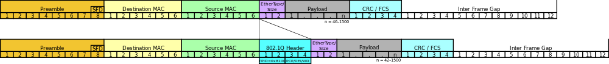

# IEEE 802.1Q
> **IEEE 802.1q** — открытый стандарт, который описывает процедуру тегирования трафика для передачи информации о принадлежности к VLAN.

`802.1Q` не изменяет заголовки кадра (фрейма), поэтому сетевые устройства, которые не поддерживают этот стандарт, могут передавать трафик без учёта его принадлежности к VLAN.

## Тег
`802.1Q` помещает внутрь фрейма **тег**, который передает информацию о принадлежности трафика к VLAN.

Размер тега — **4 байта**. Он состоит из таких полей:

* **Tag Protocol Identifier** (TPID, идентификатор протокола тегирования).
16 бит. Указывает какой протокол используется для тегирования. Для `802.1Q` используется значение `0x8100`.

---

* **Tag control information** (TCI). Также 16 бит. Состоит из следующих полей:
  * **Priority code point** (PCP). 3 бита. Используется IEEE 802.1p для задания *приоритета передаваемого трафика (class of service)*

  * **Drop eligible indicator** (DEI). Размер поля — 1 бит. Указывал на формат *MAC-адреса*. 0 — канонический (кадр Ethernet), 1 — не канонический. CFI (прежднее название) использовался для совместимости между сетями Ethernet и Token Ring.

  * **VLAN Identifier** (VID, идентификатор VLAN). Размер поля — 12 бит. Указывает какому VLAN принадлежит кадр. Диапазон возможных значений от 0 до 4095.

При использовании стандарта `Ethernet II`, `802.1Q` вставляет тег перед полем «Тип протокола». Так как фрейм изменился, пересчитывается контрольная сумма.

## Native VLAN
В стандарте `802.1Q` существует понятие **Native VLAN**. По умолчанию это `VLAN 1`. Трафик, передающийся в этом VLAN, не тегируется.