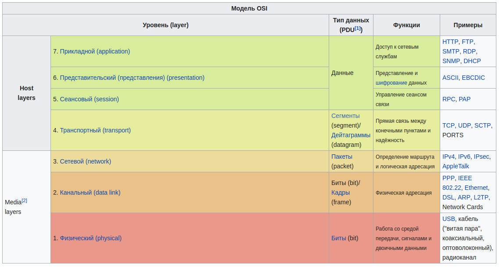

# OSI
*open systems interconnection basic reference model*

**OSI** -- **сетевая модель** стека (магазина) сетевых протоколов.

**Сетевая модель** -- теоретическое описание принципов работы набора сетевых протоколов, взаимодействующих друг с другом.

## Уровни

Посредством самого *верхнего (прикладного) уровня*, пользовательское приложение обращается в сеть, а самый *нижний уровень (физический)* определяется стандартами средств передачи данных (напр., передача по медному кабелю, оптоволокно, радиоэфир...)

Каждый уровень может взаимодействовать только со смежными уровнями.

* **Прикладной уровень** -- обеспечивается взаимотношение программы с сетью.
*Примеры*: `HTTP, SMTP, SSH`

* **Представительский уровень** -- обеспечивает преобразование протоколов и кодирование/декодирование данных.
*Примеры*: `XDR — eXternal Data Representation, AFP — Apple Filing Protocol`

* **Сеансовый уровень** -- обеспечивает поддержание сеанса связи, позволяя приложениям взаимодействовать между собой длительное время.
*Примеры*: `PPTP (Point-to-Point Tunneling Protocol), RPC (Remote Procedure Call Protocol)`

* **Транспортный уровень** -- предназначен для обеспечения надёжной передачи данных от отправителя к получателю. При этом уровень надёжности может варьироваться в широких пределах.
*Примеры*: `TCP (Transmission Control Protocol), UDP (User Datagram Protocol), ATP (AppleTalk Transaction Protocol)`

* **Сетевой уровень (L3)** -- предназначен для определения пути передачи данных.
*Примеры*: `IP/IPv4/IPv6 (Internet Protocol); RIP (Routing Information Protocol), OSPF (Open Shortest Path First)`

* **Канальный уровень (L2)** -- предназначен для обеспечения взаимодействия сетей на физическом уровне и контроля за ошибками, которые могут возникнуть. Спецификация IEEE 802 разделяет этот уровень на два подуровня: **MAC** (англ. *media access control*) -- регулирует доступ к разделяемой физической среде, **LLC** (англ. *logical link control*) обеспечивает обслуживание сетевого уровня.
*Примеры*: `IEEE 802.3 (Ethernet), IEEE 802.11 wireless LAN, Point-to-Point Protocol (PPP)`

* **Физический уровень (L1)** -- определяет метод передачи данных, представленных в двоичном виде, от одного устройства (компьютера) к другому.
*Примеры*: `802.11 Wi-Fi, ISDN, DSL, протоколы "витой пары"`