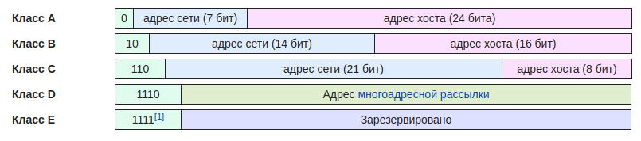
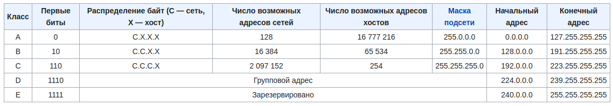
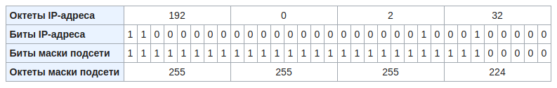

# IP-адрес
## Адресация в TCP/IP-сетях
Стек протоколов TCP/IP предназначен для **соединения отдельных подсетей**, построенных по разным технологиям канального и физического уровней (`Ethernet, Token Ring, FDDI, ATM, X.25 и т.д.`) **в единую составную сеть.**

Каждая из технологий нижнего уровня предполагает **свою схему адресации**. Поэтому на межсетевом уровне требуется **единый способ адресации**, позволяющий уникально идентифицировать каждый узел, входящий в составную сеть. Таким способом в TCP/IP-сетях является *IP-адресация*.

Узел составной сети, имеющий IP-адрес, называется **хост (host)**.

*Иллюстрацией этой концепции может выступить международная почта (индекс и адрес конкретного здания).*

## Типы адресов стека TCP/IP
В стеке TCP/IP используются три типа адресов:
* локальные (другое название – аппаратные);
* IP-адреса (сетевые адреса);
* символьные доменные имена.

Если подсетью является локальная сеть `Ethernet`, `Token Ring` или `FDDI`, то локальный адрес – это **МАС-адрес** (MAC address – Media Access Control address).
МАС-адрес имеет размер **6 байт** и записывается в шестнадцатеричном виде, например `00-08-А0-12-5F-72`.

**IP-адреса** (IP address) представляют собой основной тип адресов, на основании которых сетевой уровень передает сообщения (*IP- пакеты*). Эти адреса состоят из **4 байт**, записанных в десятичном виде и разделенных точками, например `117.52.9.44`. Номер узла в протоколе IP назначается независимо от локального адреса узла.

Маршрутизатор по определению входит *сразу в несколько сетей*. Поэтому каждый порт маршрутизатора имеет собственный IP-адрес. Конечный узел также может входить в несколько IP-сетей. В этом случае компьютер должен иметь несколько IP-адресов, по числу сетевых адаптеров. Таким образом, IP-адрес характеризует не отдельный компьютер или маршрутизатор, а одно сетевое соединение.

**Символьные доменные имена** (domain name) служат для удобства представления IP-адресов. Разработана специальная служба, **DNS (Domain Name System)**, устанавливающая соответствие между IP-адресами и символьными доменными именами, например [www.rambler.ru]

## Структура IP-адреса
IP-адрес представляет собой 32-разрядное двоичное число, разделенное на группы по 8 бит, называемых *октетами*, например: `10101100 00010000 00101111 01011110`. Макс. значение октета `11111111 == 255`.

IP-адрес состоит из двух логических частей – **номера подсети (ID подсети)** и **номера узла (ID хоста)** в этой подсети.

Для определения того, какая часть IP-адреса отвечает за ID подсети, а какая за ID хоста, применяются два способа:
* с помощью классов
* с помощью масок

При передаче пакета из одной подсети в другую используется ID подсети. Когда пакет попал в подсеть назначения, ID хоста указывает на конкретный узел в рамках этой подсети.

Если в IP-адресе 172.16.123.1 первые два байта отводятся под номер подсети, остальные два байта – под номер узла, то номера записываются следующим образом:
* ID подсети: `172.16.0.0`
* ID хоста: `0.0.123.1`

По числу разрядов, отводимых для представления номера узла (или номера подсети), можно определить общее количество узлов (или подсетей) по простому правилу: если число разрядов для представления номера узла равно N, то **общее количество узлов** равно `2^N – 2`.

Два узла вычитаются вследствие того, что эти адреса являются особыми и используются в специальных целях (первый — **адрес сети**, последний — **directed broadcast**).

Например, если под номер узла в некоторой подсети отводится два байта (16 бит), то общее количество узлов в такой подсети равно `2^16 – 2 = 65534` узла.

## Классы IP-адресов
Существует пять классов IP-адресов: `A, B, C, D, E`. За принадлежность к тому или иному классу отвечают первые биты IP-адреса. Целью такого деления являлось создание малого числа больших сетей (класса А), умеренного числа средних сетей (класс В) и большого числа малых сетей (класс С).

Изначально адресация в сетях IP осуществлялась на основе классов: первые биты определяли *класс сети*, а по классу сети можно было сказать — сколько бит было отведено под *номер сети и номер узла*. Всего существовало 5 классов:

## Бесклассовая адресация
**Бесклассовая адресация** (англ. Classless Inter-Domain Routing, англ. CIDR) — метод IP-адресации, позволяющий гибко управлять пространством IP-адресов, не используя жёсткие рамки классовой адресации.

Бесклассовая адресация основывается на **переменной длине маски подсети (англ. variable length subnet mask, VLSM)**, в то время, как в классовой (традиционной) адресации длина маски строго фиксирована 0, 1, 2 или 3 установленными октетами.

Пример подсети 192.0.2.32/27 с применением бесклассовой адресации:

В данном примере видно, что в маске подсети 27 бит слева — единицы. В таком случае говорят о **длине префикса подсети** в 27 бит и указывают через косую черту (знак /) после базового адреса.

Для упрощения таблиц маршрутизации можно объединять блоки адресов, указывая один большой блок вместо ряда мелких. Например, 4 смежные сети класса C (4 × 255 адресов, маска 255.255.255.0 или /24) могут быть объединены, с точки зрения далёких от них маршрутизаторов, в одну сеть /22. И напротив, сети можно разбивать на более мелкие подсети, и так далее.