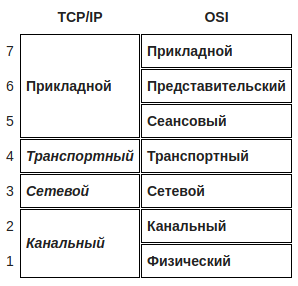

# TCP/IP

**TCP/IP** -- сетевая модель передачи данных, представленных в цифровом виде.

## Уровни
Стек протоколов TCP/IP включает в себя четыре уровня:

* **прикладной уровень (application layer)** -- работает с большинством сетевых приложений.
*Примеры:* `HTTP, RTSP, FTP, DNS`

---

* **транспортный уровень (transport layer)** -- могут решать проблему негарантированной доставки сообщений (*«дошло ли сообщение до адресата?»*), а также гарантировать правильную последовательность прихода данных. В стеке `TCP/IP` транспортные протоколы определяют, для какого именно приложения предназначены эти данные. 
Протоколы автоматической маршрутизации, логически представленные на этом уровне (поскольку работают поверх `IP`), на самом деле являются частью протоколов сетевого уровня; например `OSPF`.
*Примеры:* `TCP, UDP, SCTP, DCCP; RIP, OSPF`

---

* **сетевой уровень (межсетевой) (Internet layer)** -- разработан для передачи данных из одной сети в другую.
*Примеры:* `IP`
*Примечание:* вспомогательные протоколы, вроде `ICMP` и `IGMP`, работают поверх `IP`, но тоже относятся к сетевому уровню; протокол `ARP` является самостоятельным вспомогательным протоколом, работающим поверх канального уровня

---

* **канальный уровень (link layer)** -- описывает способ кодирования данных для передачи пакета данных на физическом уровне (то есть специальные последовательности бит, определяющих начало и конец пакета данных, а также обеспечивающие помехоустойчивость).
Канальный уровень иногда разделяют на 2 подуровня — `LLC (Logical Link Control)` и `MAC (media access control)`.
*Примеры:* `Ethernet, IEEE 802.11 WLAN, SLIP, Token Ring, ATM и MPLS`

## TCP и UDP
* **TCP** *(IP идентификатор 6)* — «гарантированный» транспортный механизм с предварительным установлением соединения, предоставляющий приложению надёжный поток данных, дающий уверенность в безошибочности получаемых данных, перезапрашивающий данные в случае потери и устраняющий дублирование данных. TCP позволяет регулировать нагрузку на сеть, а также уменьшать время ожидания данных при передаче на большие расстояния. Более того, TCP гарантирует, что полученные данные были отправлены точно в такой же последовательности.

---

* **UDP** *(IP идентификатор 17)* - протокол передачи *датаграмм* без установления соединения. Также его называют протоколом «ненадёжной» передачи, в смысле невозможности удостовериться в доставке сообщения адресату, а также возможного перемешивания пакетов.

## Сравнение уровней с OSI
